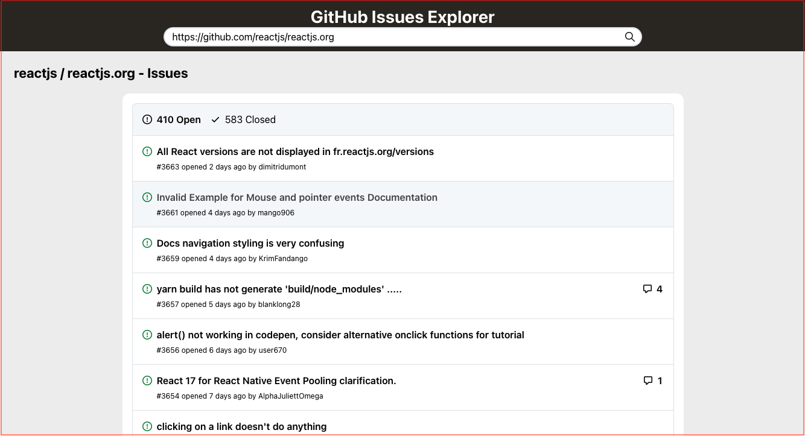
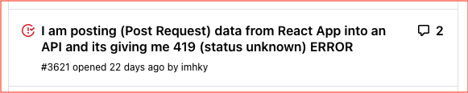
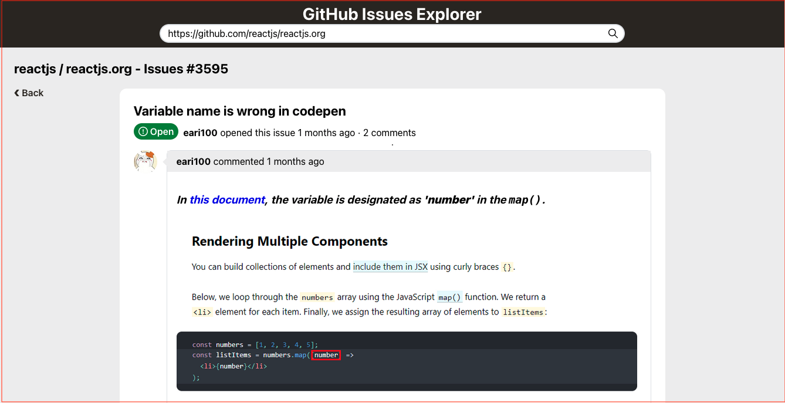
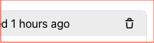

# GitHub Issues Explorer

A small client application using GitHub [QraphQL API](https://docs.github.com/en/graphql).

## Getting Started

### 1. Get your GitHub access token

Follow the steps in [Creating a personal access token](https://docs.github.com/en/github/authenticating-to-github/creating-a-personal-access-token) to create a token.

To match the behavior of the [GraphQL Explorer](https://docs.github.com/en/graphql/guides/using-the-explorer), request the following scopes:

```
user
public_repo
repo
repo_deployment
repo:status
read:repo_hook
read:org
read:public_key
read:gpg_key
```

Save your new access token.

### 2. Clone the code

```
git clone git@github.com:vuongvu1/github-issues-explorer.git
```

### 3. Install dependencies

(recommend)

```
yarn install
```

or

```
npm install
```

### 4. Add environment variables

- Create an `.env` file in the project root directory
- Copy the content in `.env-template` to the `.env`
- Copy your new access token in step 1 to the value `REACT_APP_GITHUB_TOKEN`

### 5. Start the application

```
yarn start
```

or

```
npm start
```

## Features Introduction

### 1. Overview

#### The app has 2 main views:

- All Issues view
  

  Each row will show the issue brief info:

  - status icon
  - title
  - number of comments
  - issue number
  - time since created
  - author name
    

- Issue Detail view

  The issue detail page will show full info:

  - title
  - status icon and text
  - number of comments
  - issue number
  - time since created
  - author name
  - all comments and commentors
  - user comment editor

  

#### Support mobile


### 2. GitHub Repository Input Bar


User can paste every repository address in the input bar, the default value is "https://github.com/reactjs/reactjs.org", the app will show the issues accordingly. If you change the repo address when viewing an issue detail, you will be automatically redirected to the `All Issues` view.

### 3. Issue Filter


User can filter issues based on their open/closed status.

### 4. Pagination


The app support basic pagination with maximum 3 pages showed and Previous and Next button.

### 5. Add Comments


User can add comments on every issues, the editor supports markdown. The page will automatically update after user add a new comment.

### 6. Delete Comments



User can delete comments on every issues, noted that you can only delete your own comments or other's comments on your own issues.
